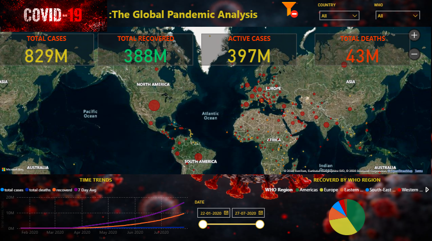
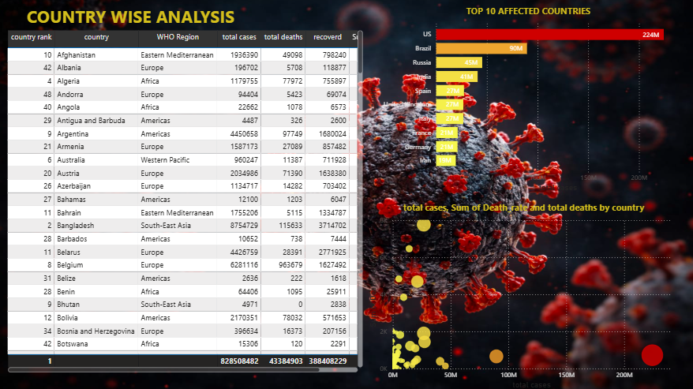
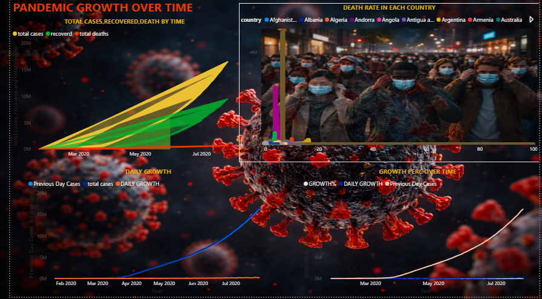

# GLOBAL-COVID-19-DATA-ANALYSIS-DASHBOARD
End-to-end COVID-19 analytics project using Python, SQL, and Power BI to analyze cases, deaths, recovery, and growth trends

## 📌 Overview
This project analyzes global COVID-19 data using Python, SQL, and Power BI to understand trends, country-wise impact, and trend.

---

## 🎯 Objectives
- Analyze pandemic trends over time
- Compare country-wise impact

---

## 🛠️ Tools Used
- Python (Pandas)
- SQL (MySQL)
- Power BI
- DAX

---

## 🔄 Workflow
1. Data Cleaning (Python)
2. SQL Analysis
3. Dashboard Creation (Power BI)
4. Insight Generation

---

## 📊 Dashboard Preview

### Overview

### Country Analysis

- SQL (MySQL)
- Power BI
- DAX

---

## 🔄 Workflow
1. Data Cleaning (Python)
2. SQL Analysis
3. Dashboard Creation (Power BI)
4. Insight Generation

---

## 📊 Dashboard Preview

### Overview

### Country Analysis

- SQL (MySQL)
- Power BI
- DAX

---

## 🔄 Workflow
1. Data Cleaning (Python)
2. SQL Analysis
3. Dashboard Creation (Power BI)
4. Insight Generation

---

## 📊 Dashboard Preview

### Overview

### Country Analysis

### Trend Analysis

---

## 🔍 Key Insights
- Few countries contributed most global cases
- Pandemic showed multiple waves
- Vaccination reduced cases and deaths
- Recovery improved over time

---

## 📁 Project Structure
data/
sql/
scripts/
images/

---

## ⚙️ How to Use
1. Run Python scripts
2. Execute SQL queries
3. Open Power BI dashboard)

### Trend Analysis

---

## 🔍 Key Insights
- Few countries contributed most global cases
- Pandemic showed multiple waves
- Vaccination reduced cases and deaths
- Recovery improved over time

---

## 📁 Project Structure
data/
sql/
scripts/
images/

---

## ⚙️ How to Use
1. Run Python scripts
2. Execute SQL queries
3. Open Power BI dashboard)

### Trend Analysis

---

## 🔍 Key Insights
- Few countries contributed most global cases
- Pandemic showed multiple waves
- Recovery improved over time

---

## 📁 Project Structure
data/
sql/
scripts/
images/

---

## ⚙️ How to Use
1. Run Python scripts
2. Execute SQL queries
3. Open Power BI dashboard
